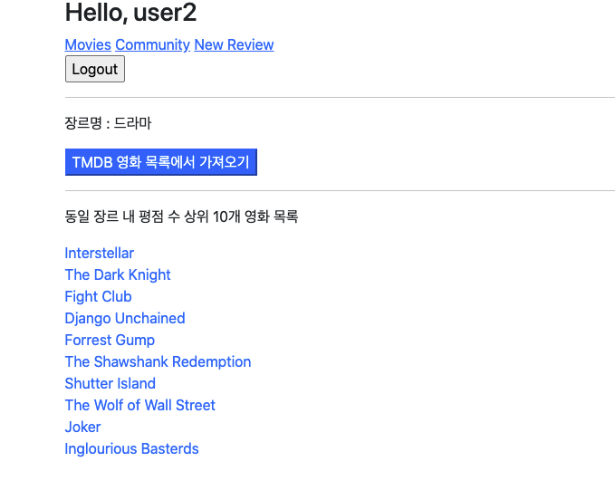

# PJT09_알고리즘을 적용한 서버 구성

>목표
>
>- AJAX 통신과 JSON 구조에 대한 이해
>- 추천 알고리즘 작성

이번 관통 프로젝트에서는 CRUD가 구현된 커뮤니티 app이 제시되고, 이 중 게시물의 좋아요 버튼과 유저 팔로우 기능을 AJAX 통신을 이용해 동적으로 제어하는 코드를 작성했다. 이후 movies app에서 사용자들에게 영화를 어떻게 추천할지 알고리즘을 작성했다.


## 1. AJAX & JSON

> 리뷰 좋아요, 유저 팔로우 AJAX

##### 1) Review like

- 기존의 구조는 form 태그 내에서 action 속성의 값으로 url 요청을 보내고 method도 속성으로 명시하며, form 태그 블럭 내에 csrf_token을 함께 작성하는 방식으로 요청을 보냈다.

- AJAX 구조에서는 해당 tag의 이벤트가 발생하면 비동기적으로 요청을 보낸다.

- axios library 사용

  ajax 통신을 하기 위해 axios 라이브러리를 사용하고 아래 script 문 안에서 사용한다.

  ```js
  <script src="https://cdn.jsdelivr.net/npm/axios/dist/axios.min.js"></script>
  ```

- forEach

  현재 review 게시물 전체 목록을 보여주고 있으므로 각각의 form 태그들에 대하여 이벤트를 추가해주기 위해 forEach 문을 작성한다.

  ```js
  const likeForms = document.querySelectorAll('.like-form')
  likeForms.forEach( (form) => {}
  ```

- form.addEventListner / data-*

  위 개별 form에 이벤트를 추가한다. form 태그에는 submit 이벤트가 default로 발생하므로 `preventDefault()` 함수를 호출하여 기본 event 실행을 막아준다.

  ```js
  form.addEventListener('submit', function (event) {
    event.preventDefault()
  }
  ```

  해당 이벤트는 개별 reviewId를 참고해야 한다. 직접적으로 모든 reviewId를 각각 참고할 수 없으므로, html에서 개별 form 속성으로 dataset을 전달한다. 

  ```html
  <form class="d-inline like-form" data-review-id="{{ review.pk }}"><!-- form 내용 --></form>
  ```

  이후 DOM 구조에서 dataset에 담긴 reviewId 값을 가져와 URL을 구성해준다.

  ```js
  const reviewId = event.target.dataset.reviewId
  const URL = `http://127.0.0.1:8000/community/${reviewId}/like/`
  ```

- axios ajax 통신

  aixos의 인자로 requestData 객체를 생성해 전달한다. csrf 토큰의 경우 querySelector의 인자로 ['속성명'='값']을 전달하여 value 값을 찾는다.

  ```js
  const csrftoken = document.querySelector('[name=csrfmiddlewaretoken]').value
  requestData = {
    method: 'post',
    url: URL,
    headers: {
      'X-CSRFToken': csrftoken,
    },
  }
  ```

  requestData 객체에 정의된 method와 url로 요청을 보내면 views.py의 like 함수에서 backend 처리를 한다. 이 때 json 형식의 데이터로 전달하여야 되기 때문에 like_status에 필요한 값(like 여부, like 수)을 dictionary 타입으로 저장한 뒤 JsonResponse 객체를 생성해 json으로 변환하여 전달한다.

  ```python
  # community/views.py
  
  # @require_POST
  # def like(request, review_pk):
  #     if request.user.is_authenticated:
  #         review = get_object_or_404(Review, pk=review_pk)
  #         user = request.user
  
  #         if review.like_users.filter(pk=user.pk).exists():
  #             review.like_users.remove(user)
                liked = False
  #         else:
  #             review.like_users.add(user)
                liked = True
  
            like_status = {
                'liked': liked,
                'likeCount': review.like_users.count(),
            }
  #         return JsonResponse(like_status)
  #     return redirect('accounts:login')
  ```

  해당 요청의 응답을 받는 데 성공하면 아래 like 기능을 위한 코드를 구현한다.

  ```js
  axios(requestData)
    .then( (response) => {
      const likedData  = response.data.liked
      const likeCountData = response.data.likeCount
  
      const likeBtn = document.querySelector('.likeBtn')
      const likeCount = document.querySelector('.likeCount')
  
      // likeCountData
      likeCount.innerText = likeCountData
  
      if (likedData) {
        likeBtn.setAttribute('style', 'color: crimson;')
  
      }
      else {
        likeBtn.setAttribute('style', 'color: black;')
      }
  	})
  ```

  

##### 2) Review follow

- 유저 팔로우 기능도 위 review like 기능과 로직은 완벽히 일치하므로 생략


## 2. 추천 알고리즘

> 현재 fixtures data는 일부 제한된 데이터만 포함되어 있다. 그래서 우리 페어는 tmdb에서 가지고 있는 영화 목록도 함께 사용자에게 보여줄 수 있는 알고리즘을 만들기로 하였다.
>
>  추천 알고리즘은 movie detail 페이지 내 장르를 클릭하면, tmdb로 ajax 요청을 보내 해당 장르와 일치하고, 우리가 정의한 조건에 부합하는 영화 목록 중 상위 10개 리스트를 가져오는 것이다.
>
> 우리가 정의한 조건은 tmdb에 데이터를 요청할 때 1) 요청을 보내는 genreId와 일치하고, 2) vote_count가 10000개 이상이고, 3) vote_average가 8 이상이고, 4) 내림차순으로 정렬하는 것이다. 이를 query로 짜서 tmdb에 ajax 요청을 하였다.

'TMDB 영화 목록에서 가져오기' 버튼을 클릭하면 ajax 요청을 보내 영화 목록을 가져온 뒤, 이를 a 태그 처리하였다.



##### 1) api 요청 보내기

버튼에 이벤트를 추가하고 genreId를 가져온다. 요청을 보내는 URL 주소에서 api_key, 장르, vote_count, vote_average, sort 쿼리를 함께 전달하였다.

```js
const tmdbBtn = document.querySelector('.tmdbBtn')
const apiKey = 'api 개별 key값'

tmdbBtn.addEventListener('click', (event) => {
  console.log(event)
  const genreId = {{ genre.pk }}
  const URL = `https://api.themoviedb.org/3/discover/movie?api_key=${apiKey}&with_genres=${genreId}&vote_count.gte=10000&vote_average.gte=8&sort_by=vote_count.desc`
  requestData = {
    method: 'get',
    url: URL,
  }
```


##### 2) ajax 요청

- ajax에서는 우선 원래 표시되고 있던 movieDiv의 기존 목록을 빈 문자열로 대체하여 삭제하였다. 

- 이후 tmdb가 response한 json형태의 data result를 변수에 저장한다.

- 해당 배열을 돌면서 아래 html 태그를 구성하기 위한 코드를 구현하였다.

- 상위 10개 목록만을 출력하기 위해 i == 9 에서 반복문을 종료한다.

  ```html
  <div class="movieList">
    <div>
      <a href="" class="text-decoration-none">{{ movie.title }}</a>
    </div>
    <!-- 하위 movie list 생략 -->
  </div>
  ```

```js
axios(requestData)
  .then( (response) => {
    const movieDiv = document.querySelector('.movieList')
    movieDiv.innerHTML = ''
    const movieDatas = response.data.results

    for (let i = 0; i < movieDatas.length; i++) {
      const aElement = document.createElement('a')
      const movieId = movieDatas[i].id
      const movieTitle = movieDatas[i].title
      const tmpDiv = document.createElement('div')
      const str = `\{\% url 'movies:detail' ${movieId} \%\}`

      aElement.setAttribute('href', str)
      aElement.setAttribute('class', 'text-decoration-none')
      aElement.innerText = movieTitle
      tmpDiv.appendChild(aElement)
      movieDiv.appendChild(tmpDiv)

      if (i === 9) {
        break
      }
  }
})
```


## 마치며

이번 프로젝트를 통해 axios 라이브러리를 사용하여 ajax 요청을 보내는 코드를 구현할 수 있었다. 기존의 요청 시 html 페이지를 render 해주는 방식이 아니라, AJAX는 특정 데이터 값만을 화면의 변화 없이 변경할 수 있다는 데에서 사용자 경험 상 큰 이점을 갖는다.

이를 위해 axios 라이브러리를 이용하여 requestData 객체를 생성해 요청을 보내고, views.py에서 변화한 값에 대한 정보를 json 형식으로 response 해주는 것으로 이해하였다. 

application이 사용자에게 보여질 때 특정 화면을 render 해서 보여줄 것인가, 아니면 일부 데이터만 변경된 값을 보여줄 것인가를 초기에 판단하여 설계하는 것이 중요하다고 느꼈다.