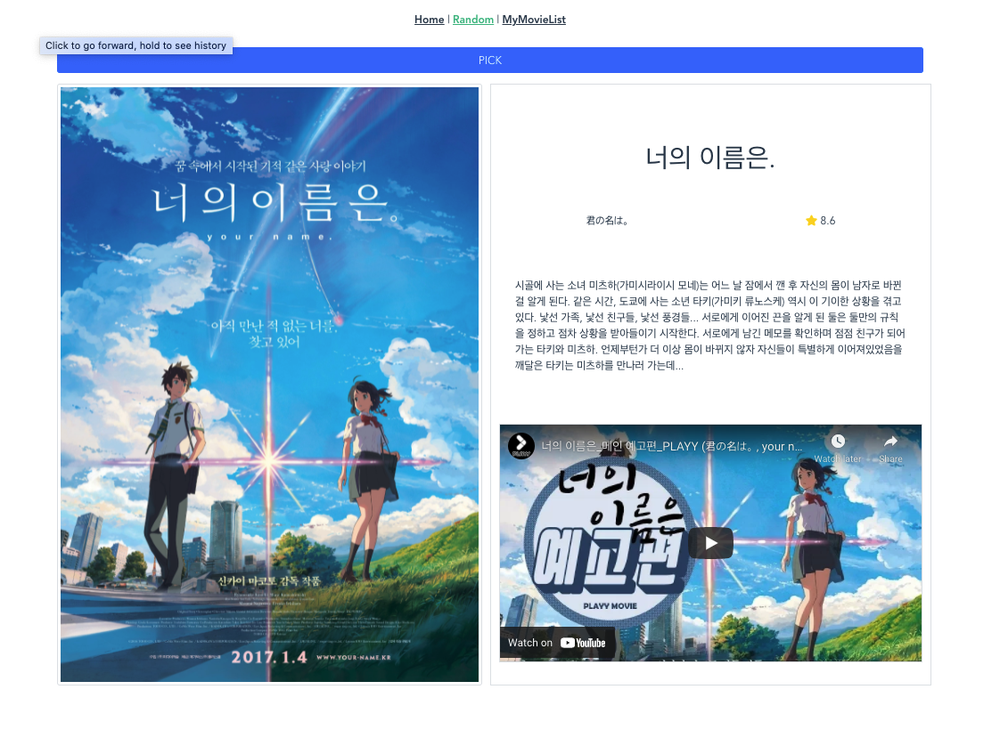
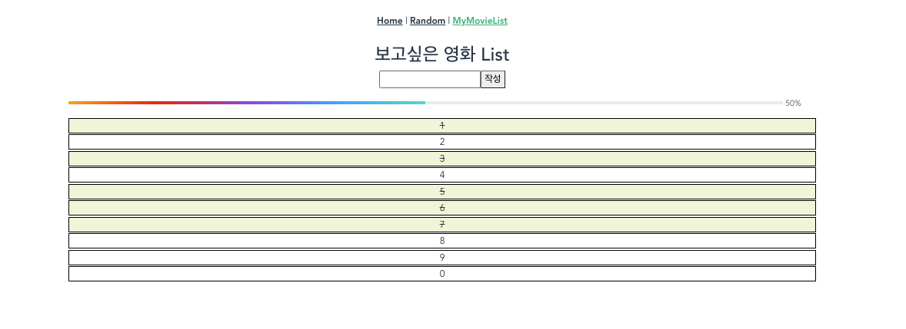

# PJT10_Vue를 활용한 SPA 구성

<small>vue의 기본이 되는 기본 구조는 vue_workshop03에서 자세하게 다루고 있으니 참고</small>

>목표
>
>- AJAX 통신과 JSON 구조에 대한 이해
>- Single File Component 구조에 대한 이해
>- vue-cli, vuex, vue-router 등 플러그인 활용

이번 프로젝트에서는 vue-router를 이용해 Single Page Application을 구현했고, Single File Component 구조 하에서 각 컴포넌트를 조작 시에 vuex를 이용해 데이터의 흐름을 체계적으로 구성할 수 있었다. 


## 1. 기본설정

vuex, vue-router 플러그인 설정 / axios, lodash 등 추가 패키지 설치

##### 1) vuex, vue-router 플러그인 설정

vuex와 vue-router 모두 vue-cli를 설치할 시에 포함되어 있는 플러그인이기 때문에 `add`를 통해서 등록만 한다. 이 때 해당 플러그인들은 `/package.json` 파일의 dependencies에 자동으로 등록된다.

```bash
$ vue add vuex
$ vue add vue-router
```

##### 2) axios, lodash 패키지 설치

필요에 따라 axios, lodash 등 추가 패키지를 설치한다.

```bash
$ npm i axios
$ npm i lodash
```


## 2. 코드 구조

- 최상위 컴포넌트인 App.vue
- routing을 담당하는 router-view와 router-link 컴포넌트
- router-view의 하위 컴포넌트인 Home / Random / MyMovieList가 있으며 각 컴포넌트는 필요에 따라 하위 컴포넌트를 가짐


## 3. Issues

##### router vs vuex

처음 컴포넌트 구조를 짤 때 router와 vuex가 함께 사용되는 것이 가능한지에 대한 의문이 있었다. src 폴더 내에 router와 store 폴더를 가지고 이 아래 모두 index.js가 포함되어 있는데 충돌이 나지 않을까 걱정하였는데, 동작하는 흐름에서 겹치는 부분이 없어 걱정할 필요는 없는 것이었다.

router는 a태그와 같이 특정 주소에 대한 요청에 대해 일치하는 component를 응답하는 구조이고, vuex는 vuex 객체의 store에서 각 컴포넌트의 데이터 흐름을 컨트롤하는 역할을 맡는 것으로 구분되었다.

따라서 router는 컴포넌트의 구조적 측면에서만 고려하면 되는 것이고, vuex는 개별 컴포넌트들의 데이터 흐름만을 고려하면 되는 것으로 이해하였다.


##### created

Home이 최초에 출력될 때 movies.json 데이터도 함께 불러들일 수 있는 방법을 고민하였다. 이 application의 기반이 되는 데이터인 movies.json 데이터는 최초에 페이지가 렌더될 때 필요한 정보라고 판단하였다. 

때문에 최초에 최상위 컴포넌트인 App.vue 인스턴스가 생성될 때 데이터를 불러들이기 위해서 App.vue 컴포넌트에서 create lifecycle hook을 이용해 axios로 데이터를 불러들여와 Vuex store의 state에 저장하였다.

```vue
<!-- App.vue -->
<script>
import axios from 'axios'

export default {
  name: 'App',
  created: function () {
    axios.get('https://gist.githubusercontent.com/eduChange-hphk/d9acb9fcfaa6ece53c9e8bcddd64131b/raw/9c8bc58a99e2ea77d42abd41376e5e1becabea69/movies.json')
        .then((res) => {
          this.$store.dispatch('getAllMovies', res.data)
        })
        .catch((error) => {
          console.log(error)
        })
  },
}
</script>
```


##### computed

computed 속성에 대해 제대로된 이해를 하지 못해서 코드를 구현할 때 고생을 하였다.

computed 객체는 key(데이터 변수)-value(데이터 값)으로 구성되어, value는 할당하고자 하는 데이터를 리턴하는 함수다.

이는 data를 직접 선언하고 할당하는 대신에 종속된 요소가 변하게 되면 다시 한 번 함수를 실행하여 변경된 data를 리턴하는 구조를 갖는다.

종속된 요소가 변하지 않았다면 다시 함수를 실행할 필요 없이 캐싱된 데이터를 사용하게 된다.


##### actions & mutations

state에 저장된 data를 다루는 데 있어서 actions와 mutations 어느 영역에서 해야할지 혼돈이 많았다. 

data를 조작하는 것은 mutations에서 담당하므로, state의 값들을 변경시켜야 할 필요가 있을 시에는 mutations에서 처리하도록 통일하였다.

이외 비동기 요청은 actions에서 처리하였다. (이번 프로젝트에서는 actions에서 별도로 backend server와 통신하는 일이 없어 대개는 commit() 함수를 호출해 mutations로 이벤트를 전달하는 역할만을 담당하였다.)


## 마치며

1) Home의 리스트는 부트스트랩 카드 컴포넌트를 이용해 평이하게 구성하였다. 반응형 웹으로 구성하기 위해 부트스트랩 그리드 시스템을 적용하였다.

2) 영화 추천 컴포넌트는 클릭 시 현재 가지고 있는 영화 데이터 중 한가지를 출력시켜 주었으며, 위와 동일하게 반응형 웹으로 구성하였다. 이에 더하여 youtube api를 활용해 해당 영화의 trailer를 함께 출력해주었다. 영화 제목 뒤에 ' trailer'를 추가한 쿼리로 검색하여 첫번째 검색결과를 반영하므로 official trailer가 항상 출력되진 않는 한계점이 있었다.

3) 보고싶은 영화 list는 todos app과 유사한 방식으로 동작하도록 구성하였으며, 체크된 영화들은 progress bar를 이용하여 시각화하였다. <small style="font-size: 5px;">상필이 고생했어..엄지척!</small>







